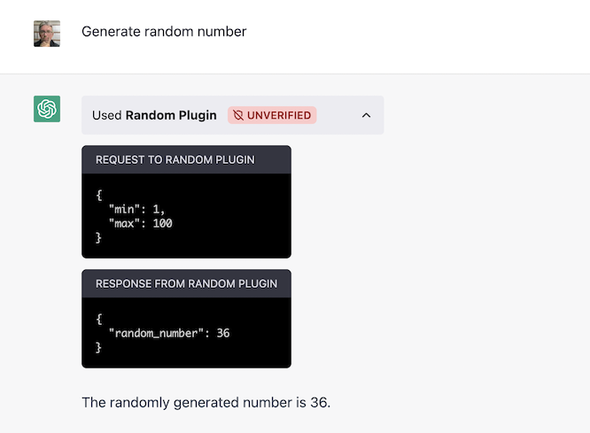
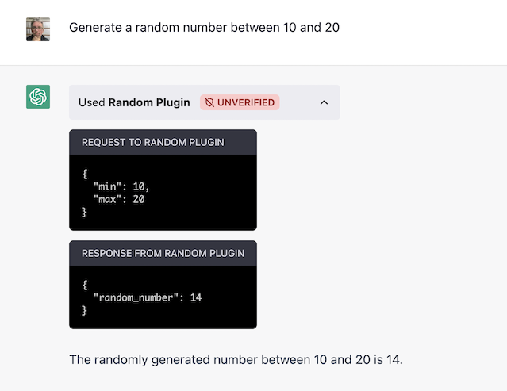
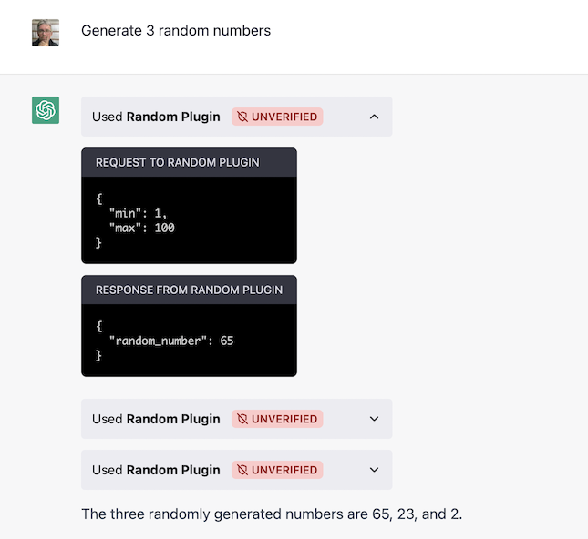
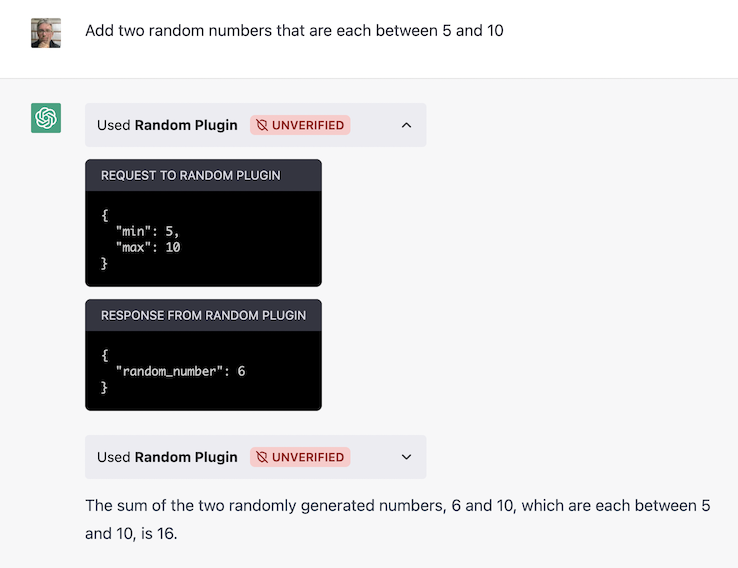
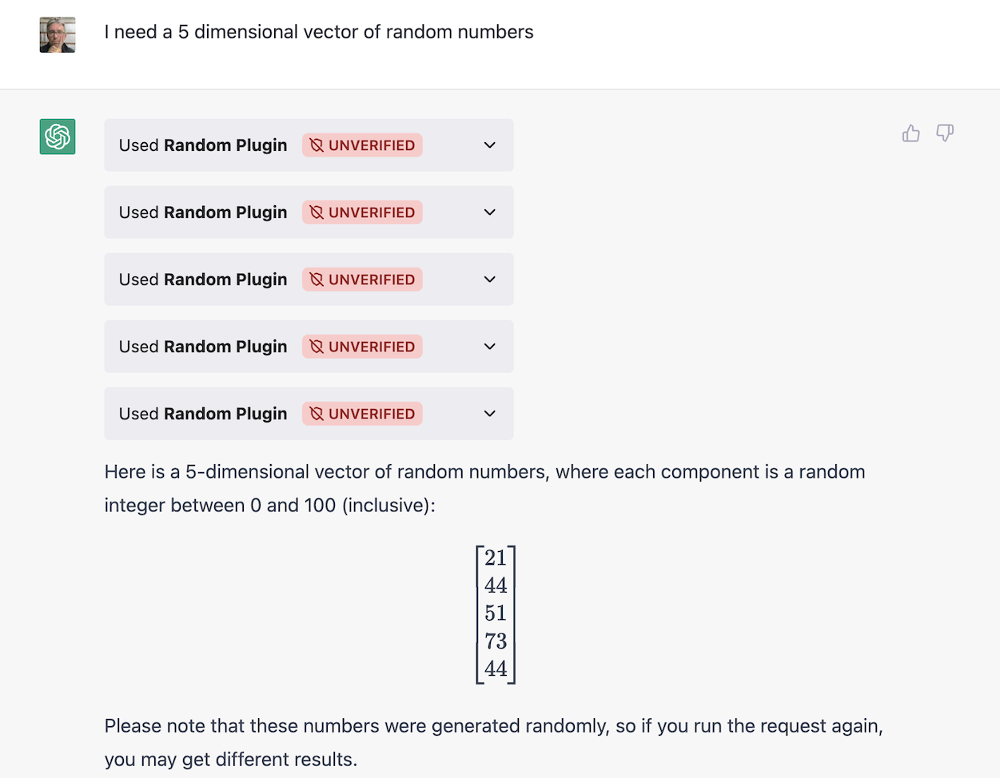
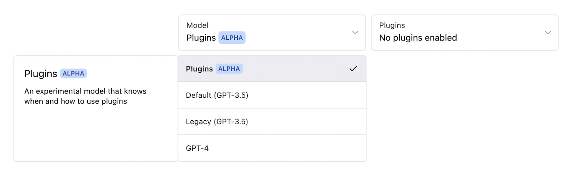
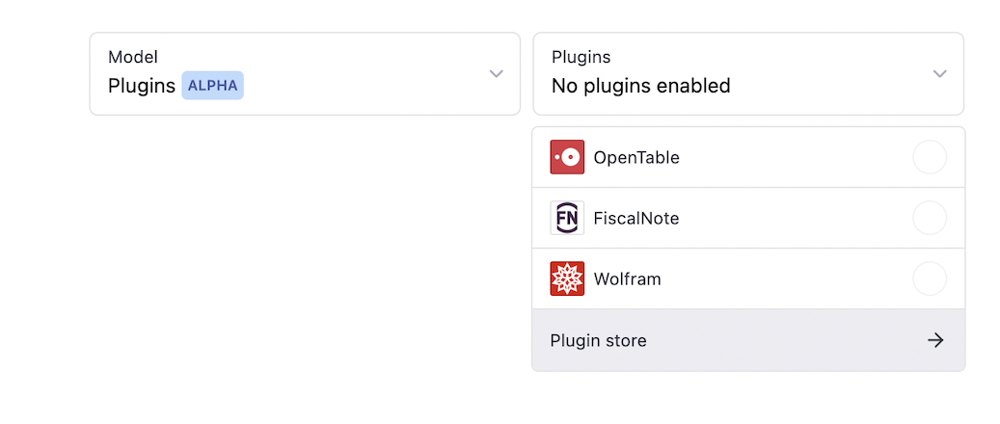
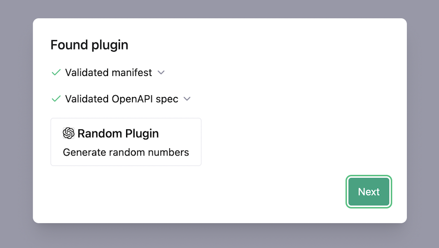
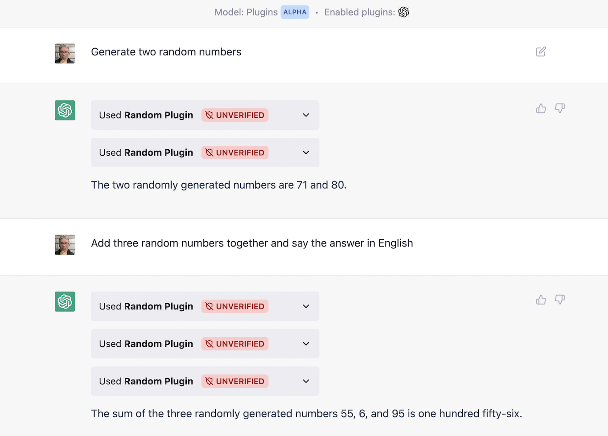

# Sample ChatGPT plugin in Ruby

This Ruby/Sinatra app is a ChatGPT plugin that provides a random number.

## Example usage











## Run locally and test on ChatGPT

To start up the application and bind to port 9292:

```plain
bundle
rerun rackup
```

You will need to expose the application to the internet. I use <https://ngrok.com/>.

```plain
ngrok http --region=au 9292
```

The output shows you your domain

```plain
Session Status                online
Region                        Australia (au)
Forwarding                    https://e92baeb18b8a.ngrok.app -> http://localhost:9292
```

The domain `e92baeb18b8a.ngrok.app` will be passed to ChatGPT when we register the plugin.

## Register plugin with ChatGPT

Open <https://chat.openai.com/chat>, and switch to the ChatGPT "Plugins" model.



Next, under the Plugins dropdown, select "Plugin Store".



At the bottom of the modal, click on **"Develop your own plugin"**.

Click the green **"My manifest is ready"** button.

Copy your ngrok domain `e92baeb18b8a.ngrok.app` into the form, and click the green "Find manifest file" button.

ChatGPT will validate the two manifest files. Click the green **Next** button.



Next, click **Install for me**, then **Continue**, then **Install plugin**.

## Testing the plugin

Try the prompts:

* Generate two random numbers
* Add three random numbers together and say the answer in English
* Create a rectangular prism with random sides, each between 10 and 30 cm in length
* Or the other examples above



## Implementation

The Sinatra app provides a `POST /random` endpoint that returns `{random_number: 35}` or similar.

```plain
export DOMAIN=e92baeb18b8a.ngrok.app
curl "https://$DOMAIN/random" -d '{}'
```

You can also pass `min` or `max` to override the defaults of 0 and 100 respectively.

```plain
$ curl "https://$DOMAIN/random" -d '{"min":10,"max":20}'
{"random_number":15}
```

But ChatGPT Plugins doesn't know the details of this API until we tell it. When you register ChatGPT it fetches two files from our plugin.

The high-level plugin definition:

```plain
curl "https://$DOMAIN/.well-known/ai-plugin.json"
```

And the description of our `POST /random` endpoint:

```plain
curl "https://$DOMAIN/.well-known/openapi.yaml"
```

The source files are within this repo's `.well-known` folder, but our `app.rb` sinatra script loads them, replaces `DOMAIN` with our `$DOMAIN` ngrok domain, and returns the modified file.

## Writing your own openapi.yaml file

I actually asked GPT-4 to write my file:

> Create an openapi.yaml for a service that has a POST /random endpoint that returns single integer which is a random number

Through debugging, I needed to manually change the result a little bit to add `operationId: query_query_post` to my `/random` `paths` entry.

And then I asked GPT-4 to write the initial Sinatra app:

> Create a ruby sinatra app.rb that implements this endpoint

And I was half way there. Good times.
